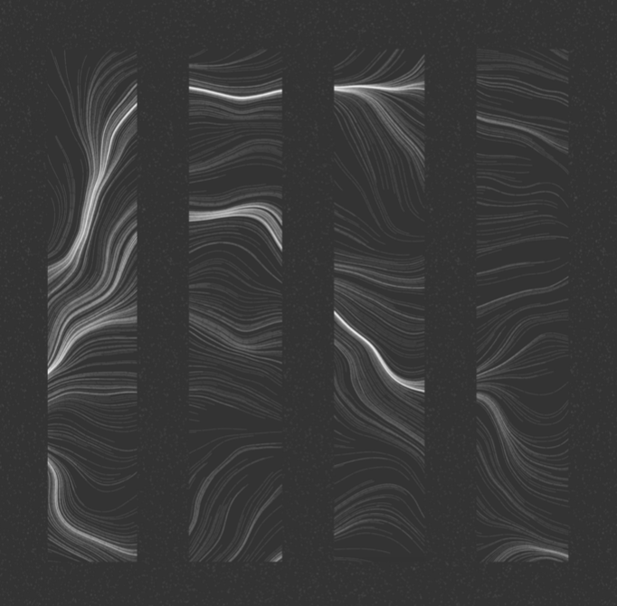
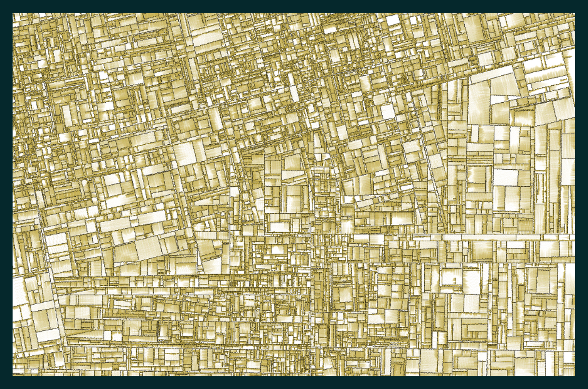

# Generative Techniques and Generative Art

Creativity is also what we call discordance, which is moving away from the path of one tradition, and so when we understand it from that perspective, how can a ‘system’ that is algorithmic, based on what we tell it to do be called creative? And how can it do something beyond what we are telling it to do? If a machine or a computer can only do whatever it is programmed to do, then how can it exhibit something we term as creative behaviour if creativity were analysed in terms of ‘Discordance’.

There has been an evolution of art and mathematics if we think about the evolution of human knowledge. So, we could leverage the mathematics behind the chaotic systems, fractals and other functions to be the seed for Generative Techniques in the creative realm.

The first technique is Generative Art, which is art created through the use of autonomous systems, such as algorithms, mathematical functions, natural language rules, genetic sequences or procedural interventions.

Generative art uses iterative commands to draw vector-based shapes on the screen. Most of the art created draws inspiration from modern art, especially pop art which makes heavy use of geometric patterns.

A wide variety of artworks that depicts mathematical principles, systems, use them as a point of departure and these areas of exploration include numerical sequences, L-system, geometric structures and algorithmic-based compositional strategies. But examples come from throughout history, from structured geometry of tiling to minimalist and conceptual artists who constructed works based on a number of systems and formal rules.

The implementation of these “generative” processes yield a range of results, from works that are rigidly ordered to those that rely largely on elements of chance and randomization. An autonomous system is required in the making of generative art, otherwise, the art would be classified as more on the lines of a digital art piece, and randomness is one type of autonomous system such that the art/design generated each time is unique in some sort.

Here, the role of an artist is to design the process that includes some sort of autonomy like the artist controls the randomness and the order in the art. So, we can say that elements of the art are provided by the system and the principles on which the art will be created is provided by the artist.

Before we create any kind of artwork, it is important to understand the principles and elements which are the building blocks of art. Similarly, we use the same principles when working on generative art. Together, principles and elements are combined to create art pieces.

When we talk about ‘elements’ of an art piece, these are the things that are used to create an art piece and these can be used individually and in combination for any art-making endeavour \(Jordan, 2019\). These are some of the elements that go into a work of art:

* **Colour** \(Hue, Value & Intensity\)
  * Hue is the colours used in the art piece.
  * Value is the lightness or darkness of the hue.
  * Intensity is the aspect of the brightness of the colours used.
* **Form**
  * It’s the element of art that renders a 3D art form in 2D, has some volume and could be geometric or organic.
* **Texture**
  * It’s the perceived surface quality of a work of art and it defines the way an art object feels.
* **Shapes**
  * These are the elements of art that are 2D, flat and enclosed.

Elements are the tools that are provided by a system, and the principles are applied to the elements, where are essentially the instructions on how these elements are put to work. These principles are provided by the artist. These are some of the principles following the creation of an artwork:

* **Rhythm**: This principle of art describes the movement in or of artwork on a canvas. It’s created by the repetition of elements in a piece of art.
* **Contrast**: It is the difference between art elements, like colour, value, size and texture.
* **Movement**: It’s about how viewers' eyes move through an art piece.
* **Proportion**: It’s the relationship of elements in artwork like some elements are smaller and larger than the others.
* **Balance**: It refers to the artistic elements and their symmetry and stability to work in an art piece.

To proceed into creating something, we usually have two types of approaches in generative art. One is that we initially have no results in mind, and we see what the computer generates as we play around and the second is that we have a very finalised idea in mind and by adding randomness, we try to slightly change the final outcome.

The exciting aspect about this is, the emergence of art comes to be really different each time the program is run, and sometimes, both approaches are used together to create artworks. As a generative artist, Matt DesLauriers said,

> “It's a bit of both — I typically sketch my ideas out first, but I try to keep my mind blank as I code, letting the program and generative process guide me. For example, sometimes a surprising bug or glitch ends up creating a new direction for me to work from”

Three building blocks in generative art could be described as:

* Randomness: This helps to add uniqueness to art pieces. 
* Algorithms: Implementing an algorithm visually often generate aesthetic art pieces.
* Geometry: Most of the generative art incorporates shapes, and mathematics, even high school geometry.

Once, we have everything ready, one can use the building blocks of generative art, elements and principles to create something similar to the “Substrate” art piece by Jared Tarbell. The idea behind this is pretty simple. We start with some random points on the canvas and start drawing random lines in random directions. But, as soon as these lines collide with each other, it starts creating new lines at an angle of 90 degrees. 

