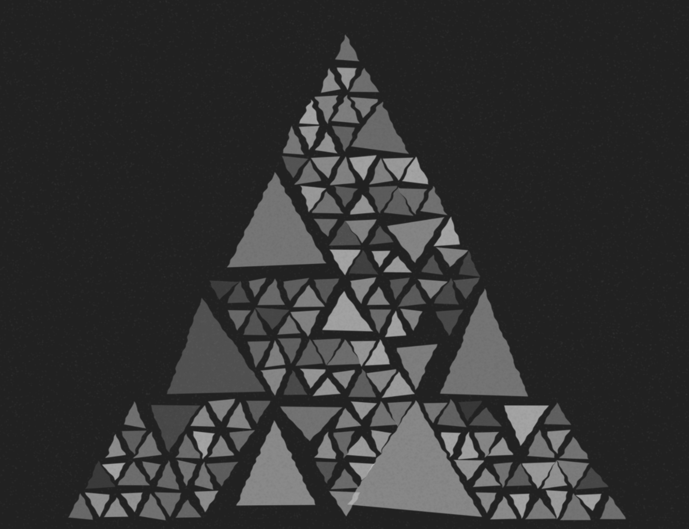
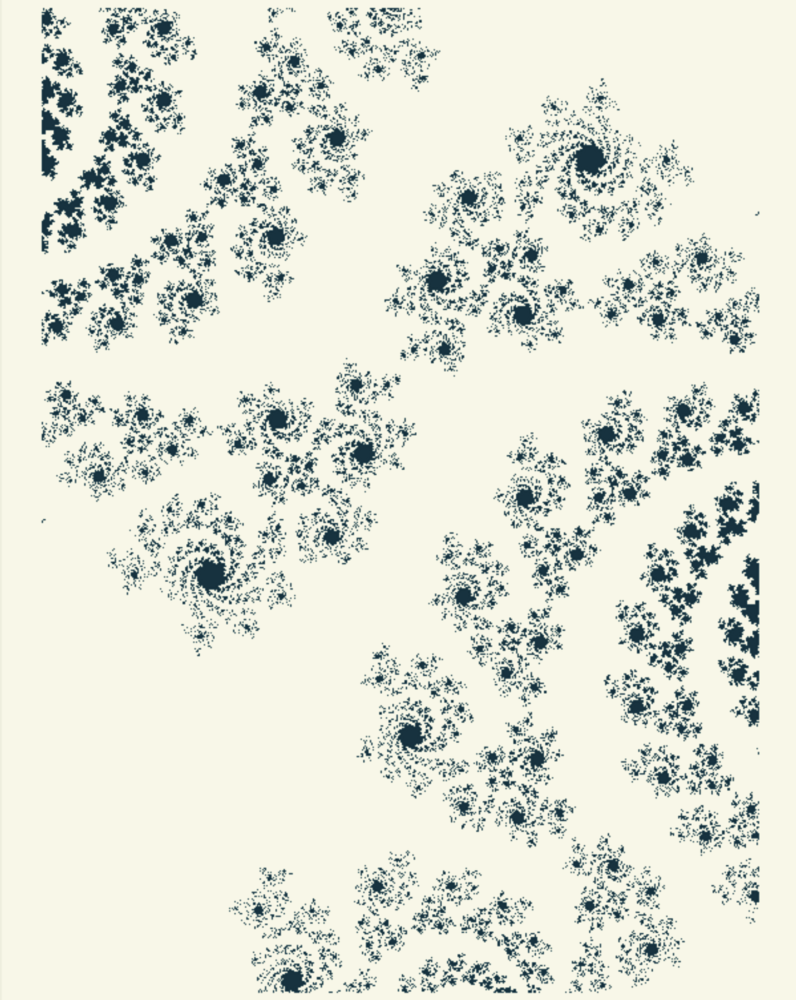

# Geometry, Fractals and Chaotic Systems

Geometry plays an important role in the creation of generative art and algorithms. If we look around the work throughout history, there is evidence of artists using iterative symmetry of geometric figures to generate form. Even geometry is the most important factor for understanding numbers. Greek Mathematicians’ ideas about numbers were closely related to geometry - to quantities like length, perimeter, and area. As a result, there was no developed concept of negative numbers since such geometric quantities are always positive! This is not only important in generative art, but also in the field of architecture, music, poetry, and visual arts.

Generative art is an interpretative field used to redraw tools beginning from Geometry. Using fundamental laws of generative art, it is a medium to build parallel, multiple, and progressive paths of dynamic transformations using interpretative logic. The key lies in its ability to represent the interpretation of a creator performing the artworks in an endless multiplicity of the possible variation. One of the main fields, geometry, owes to the construction of these generative algorithms and is the main tool for managing dynamic modification processes.

Geometry is one of the main fields involved also in the construction of generative algorithms. Not only for architecture, design, and visual art but also for music and Poetry. Since Generative Art moves from static forms to progressive transformations, Generative Geometry should be considered as the main tool for managing dynamic processes of transformation. Generative Geometry moves from geometric figures to the representation of dynamic logic processes, from measures to dynamic proportions, from measurable figures to measures related to a point of view, from representations of limited spaces to representations of infinity \(Soddu, 2014\).

When we look back at ancient architecture, we see numerous examples where symmetry \(golden ratio, musical ratio, square\) is being used in the creation of architectural sites, and there have been critics who oppose the concept of symmetry as an autonomous system. Upon analysis and deeper study of symmetry in various objects, it can be said that the use of symmetry is more of an autonomous system than a piece of art and is more primitive when symmetry and geometry are used in textiles, repeating shapes, and more. Generative art also draws inspiration from the use of tiling in the architecture, more particularly with the abstract systems to decorate specific surfaces especially from the Islamic and Roman architecture where lies the roots of algorithms and bassinet of mathematical innovations.

Fractals are unique and complicated mathematical forms of art. These are the neverending patterns, which means no matter how much we zoom in we will see a similar pattern over and over again on any scale. Fractals are everywhere from the snowflakes, galaxies, cloud formations, broccoli, and flowers in nature. The term fractal was coined by Benoit Mandelbrot, who worked at IBM in New York.

He was inspired by the works of mathematicians to understand the curve and experiments like a single line could be divided forever, and he noticed a strange pattern out there, and put a 35 lot of numbers in the IBM machines, and came up with an interesting design. He found that the patterns keep on repeating again and again, and the process led him to a breakthrough equation, resulting in his own numbers and the creation of the ‘Mandelbrot’set. For him, it was a pragmatic desire to model nature in a way that actually captures roughness such that these self-similar shapes could give a basis for modeling the regularity in some sort of roughness.

One of the most amazing facts about the Mandelbrot fractal is that the more you zoom in the newer patterns you see forming inside of it. This also led to the new era of math called the ‘Fractal geometry’, and has been used in fields like climate change, trajectories of meteoroids, and more. Fractals are quite popular among programmers and generative artists because a small set of code can produce images that are way more intricate than any human hand could ever hope to draw.

The Mandelbrot fractal is represented on a complex plane where there is a coordinate that has complex numbers. The X-Y axis represents the real axions and the Z-axis represents the imaginary part. We pick a number C, any number in the complex plane and start with z = 0, and then iterate the equation over and over again. If it blows up to infinity, then the number C is not part of the set, and if the number C remains finite after infinite iterations, it's a part of the Mandelbrot set. If C is held constant and the initial value of z is variable instead, then one obtains the corresponding Julia set for each point in the parameter space of the simple function.

