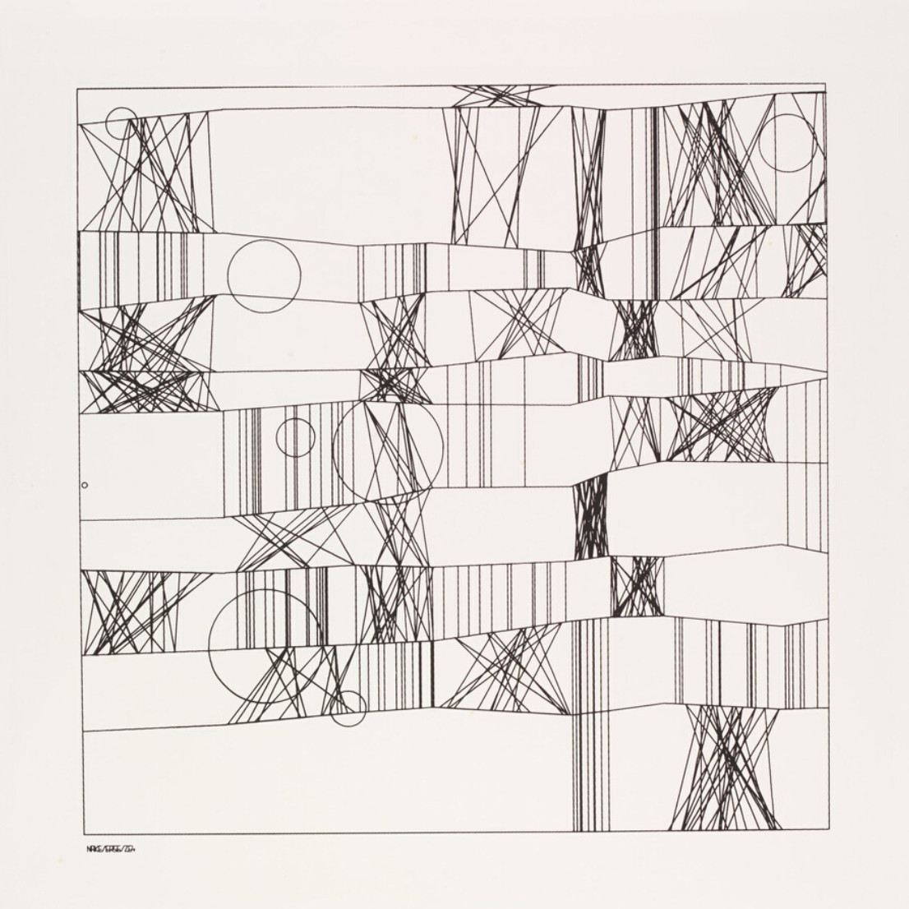
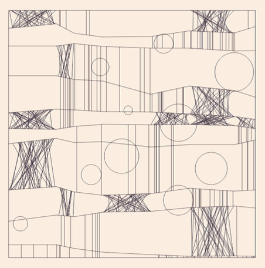

# History and Background

In analog art; the art which is manipulated by hand, complexity, and scale requires exponentially more effort and time, and computers excel at repeating processes near endlessly without exhaustion. The ease at which computers can generate complex images contributes greatly to the aesthetics of generative art.

One major challenge faced by early generative artists was the limitation of an output device. The primary source at those times was a punch card and a plotter - a mechanical device holding a pen whose movements were controlled by the instructions programmed in a computer. Plotter drawings were typically black on white paper and as such most of the early works produced were black and white, even after printers began to be used.

Generative art has received criticism for decades for its perceived artificiality. Most theorists and practitioners are not interested in the history of generative art and believe that the idea of generative art has an expansive history predating computational experiments. Critiques even argue that generative artists give away the physical control of the artworks and rely on machines to finish it for them, and the finished outcome is far from the perception of art. Contrary to that, today generative art, paintings, poems, music is used in art installations, personal collections, and museums around the globe.

One of the first artists to produce plotter drawings was Frieder Nake, and this is his famous art piece named “Hommage à Paul Klee” which Klee made in 1965. This artwork is based on a painting by Paul Klee, entitled “High Roads and Byroads”. Frieder Nake took Klee’s exploration of proportion and the relationship between the horizontal-vertical lines and ellipses as the backbone of the artwork. He adds a lot of randomness to the size, scale, and proportion of lines and ellipses on a pen plotter.

Generative art is one of the best options to create such art pieces because imagine for a second, you wanted to create something like the “Schotter” on a piece of paper using a pen. It might take hours to create one. On the other hand, add a few instructions to the computer, and we can produce thousands of such artworks in a couple of minutes.

Vera Molnar is a French media artist and one of the first women pioneers in the field of Generative art. She invented a “machine imaginaire” that allowed her to create an image series of preordained compositional rules. Using endless variations in geometry and lines, generative art became one of the best mediums for her artworks. 

Her art piece named Dés Ordres, which she made in 1974, received significant criticism bringing up the debate around whether art made with computers is artificial or real art. The majority of people in those early decades of computing had little to no contact with computers or frames of reference outside of science fiction. Against this backdrop and in a time where women faced tremendous sexism in the workplace, a large number of female generative artists emerged, making key contributions to the craft and the community \(Bailey, 2018\). 

Digital designer and researcher, Muriel Cooper too made quite an influence in the establishment of aesthetics in the computing revolution. She co-founded MIT’s Visual Language Workshop in 1975, which moved to MIT Media Lab in 1985 as “one of its funding sources”. She believed that the shift from mechanical to an information society demands new communication processes, new visual and verbal languages, and new relationships of education, practice, and production. \(Bailey, 2018\).

