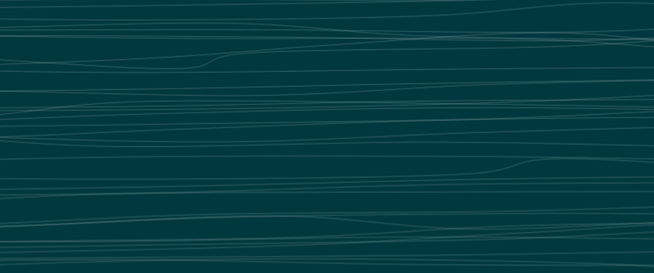

# Mathematics, Algorithms & Geometry

In generative techniques, mathematical systems play a vital role in creating different shapes, adding randomness and noise, chaotic systems, fractals, and so forth.

Before we use any mathematical function, chaotic systems, geometric patterns, vector operations we need to understand how exactly a ‘canvas’ looks like when we are working on a generative art piece.

The canvas is like a two-dimensional cartesian plane where each point can be considered as a vector. Here, we are talking about a vector in two-dimensional cartesian coordinates which is the distance between the two points. As shown above, there is a cartesian plane on the right side, and a point is denoted by (X, Y), and the point (X, Y) stores instructions on how to get to that position point from the previous point or the origin. Further, linear algebra operations like linear transformations, scaling, rotations could be applied to draw lines, create shapes, and more.

Once, we are familiar with the 2D cartesian coordinate system, which is on how to measure x and y position on the canvas, the scope of experimentation begins by utilizing a wide array of operations as reflected upon in the previous paragraph. Similarly, if we add an extra position by adding a z-value, we would be able to measure how far we are above or below the 2D cartesian plane, and eventually we will be able to draw in three-dimensional coordinates.

As discussed earlier, randomization is a major part of creating generative art. Random methods differ in different programming languages. But the main objective is to provide us with a random floating-point number between 0, 1. These random numbers generated have no relationship with each other, such that if we place a set of random numbers generated on a graph, it will form a zig-zag line.

There is another method named “Perlin Noise”, developed by Ken Perlin while he was working on the original Tron movie in the early 1980s. He used it to create procedural textures for computer-generated effects. Unlike random numbers, which have no relationship with the last number generated and show no discernible pattern, in Perlin noise, the numbers generated at a specific point have a relationship with the last number generated. Thus, it could be said to be more organic in appearance and predictable because these numbers are naturally ordered sequences of pseudo-random numbers, and is useful for ‘add’ movement to an artwork. For example, if we have two points on a cartesian plane, and those points are pretty close to each other than the Perlin noise numbers generated on those two points would be quite close to each other, and if we place a graph on a set of Perlin noise, the graph would be much smoother and more predictable.

These are 2D fields of vectors, each pointing in a similar but different direction as its neighboring vector, and their velocities are affected by the vectors themselves. Depending on how we draw the particles during animations, use mathematical functions like trigonometry, one can generate some cool stuff! Similarly, _simplex_ noise can be constructed for n-dimensional noise functions comparable to Perlin Noise in higher dimensions. An implementation typically involves four steps: coordinate skewing, simplicial subdivision, gradient selection, and kernel summation.
