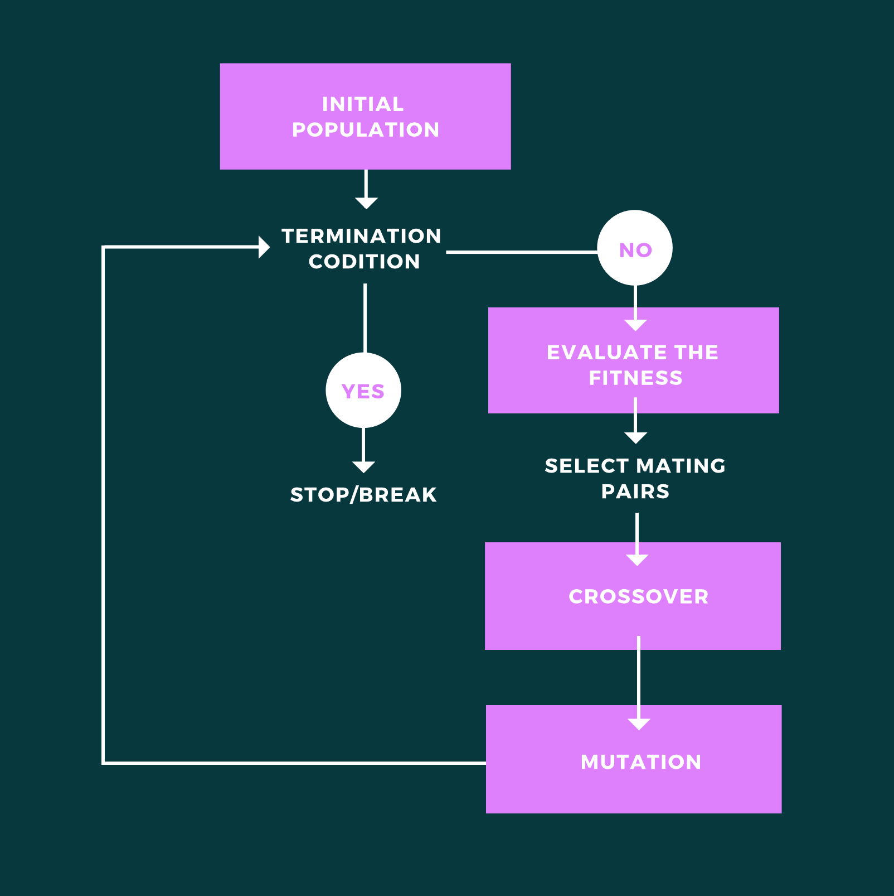

# Genetic Algorithms

  
​‌

Nature is incredibly smart. Through millions and billions of years, it has found ways to optimize just about everything it does. All aspects of our lives are driven by computation and algorithms, how we learn, play, work. Given the situation, we can say Generative Art best reflects our present time - work created at least in part with autonomous systems, where artists use heavy use of mathematical functions, geometry algorithms to create aesthetically appealing art pieces. To reflect this, artists have also been using evolutionary algorithms, or more generally ‘Genetic algorithms’ in their artworks, which in simpler words is an optimization technique that mimics the Darwinian laws of natural selection, the ‘survival of the fittest’, and depending on what type of problem we are working on these algorithms could be tailored accordingly.

There are three types of genetic operations that can then be performed:

* **Crossover**: It represents reproduction and crossover, similar to what is seen in Biology, where an offspring takes on certain characteristics from its parents. 
* **Mutation**: It represents the biological mutation and helps to maintain genetic diversity from one generation to the other generation by introducing small changes. 
* **Selection**: It’s a stage where offspring genomes are chosen from the population for crossover.

Here we can cross-think of working with images and art, so the fitness value will be calculated on the basis of how different colour pixels are present. There are a lot of different selection methods out there, and one such method is the Tournament selection, which could be used for this purpose. In Tournament selection, we choose individuals \(chromosomes\) from the population and force them to find a tournament. We choose the winner based on each participant's fitness, which goes further to mate and propagate genes.

Once we have our new generation, we can also check for some mutation by applying it to the selected parents and generate new offspring with altered genes. This way, we would get the best-optimized solution and in this case, the initial set of random shapes would eventually replicate the original image.

This process indeed has an immense amount of ‘randomness’ and ‘complexity’ built-in, that the result might pass the Lovelace test. Perhaps the creativity here is coming from the artist or the programmer who is writing the code, even though most of it includes some sort of randomness. But, when we consider the final output, it can be ascertained that the final outcome is something that has the capability of surprising the viewer and let them have this “aha” eureka moment. And when such a thing happens, then it doesn’t matter who created the piece of art because surprise in the outcome is a sort of satisfaction. And thus, it can be said that machines could be considered creative because of the satisfaction is giving to the viewer. Several AI artists feel that this is one of the most cherished moments of their work \(Live and Mail Interviews\).

One thing is certain, that we are now able to co-create narratives with these machines in numerous different ways. And these lay the foundations of AI art and creativity

